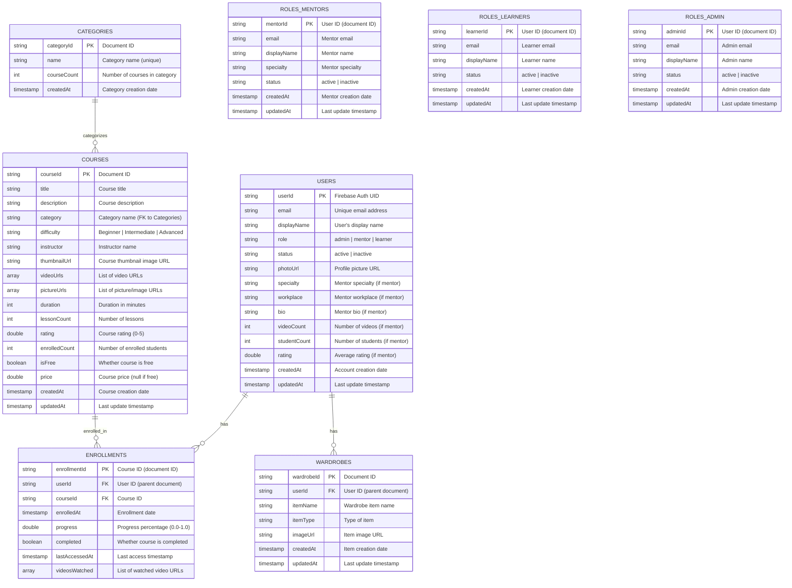

# Entity-Relationship Diagram (ERD) for StyleHer Application

## Overview

This ERD represents the Firestore database structure for the StyleHer application. The diagram shows all entities, their attributes, relationships, primary keys, and foreign keys.

## Mermaid ERD Diagram

## Firestore Collection Structure

### Main Collections

#### 1. `users` Collection
**Path**: `/users/{userId}`

**Primary Key**: `userId` (Firebase Auth UID)

**Attributes**:
- `userId` (PK, String) - Firebase Auth UID
- `email` (String, Required) - User email address
- `displayName` (String, Optional) - User's display name
- `role` (String, Required) - User role: "admin", "mentor", or "learner"
- `status` (String, Required) - Account status: "active" or "inactive"
- `photoUrl` (String, Optional) - Profile picture URL
- `specialty` (String, Optional) - Mentor specialty (only for mentors)
- `workplace` (String, Optional) - Mentor workplace (only for mentors)
- `bio` (String, Optional) - Mentor bio (only for mentors)
- `videoCount` (Integer, Optional) - Number of videos (only for mentors)
- `studentCount` (Integer, Optional) - Number of students (only for mentors)
- `rating` (Double, Optional) - Average rating (only for mentors)
- `createdAt` (Timestamp, Required) - Account creation timestamp
- `updatedAt` (Timestamp, Required) - Last update timestamp

**Subcollections**:
- `enrollments/{courseId}` - User course enrollments
- `wardrobes/{wardrobeId}` - User wardrobe items

#### 2. `courses` Collection
**Path**: `/courses/{courseId}`

**Primary Key**: `courseId` (Document ID)

**Attributes**:
- `courseId` (PK, String) - Document ID
- `title` (String, Required) - Course title
- `description` (String, Required) - Course description
- `category` (String, Required) - Category name (FK to Categories)
- `difficulty` (String, Required) - "Beginner", "Intermediate", or "Advanced"
- `instructor` (String, Required) - Instructor name
- `thumbnailUrl` (String, Required) - Course thumbnail image URL
- `videoUrls` (Array<String>, Optional) - List of video URLs
- `pictureUrls` (Array<String>, Optional) - List of picture/image URLs
- `duration` (Integer, Required) - Duration in minutes
- `lessonCount` (Integer, Required) - Number of lessons
- `rating` (Double, Required) - Course rating (0.0-5.0)
- `enrolledCount` (Integer, Required) - Number of enrolled students
- `isFree` (Boolean, Required) - Whether course is free
- `price` (Double, Optional) - Course price (null if free)
- `createdAt` (Timestamp, Required) - Course creation timestamp
- `updatedAt` (Timestamp, Required) - Last update timestamp

**Foreign Keys**:
- `category` → `categories.name`

#### 3. `categories` Collection
**Path**: `/categories/{categoryId}`

**Primary Key**: `categoryId` (Document ID)

**Attributes**:
- `categoryId` (PK, String) - Document ID
- `name` (String, Required, Unique) - Category name
- `courseCount` (Integer, Required) - Number of courses in category
- `createdAt` (Timestamp, Required) - Category creation timestamp

### Subcollections

#### 4. `users/{userId}/enrollments` Subcollection
**Path**: `/users/{userId}/enrollments/{courseId}`

**Primary Key**: `enrollmentId` (courseId - Document ID)

**Attributes**:
- `enrollmentId` (PK, String) - Course ID (document ID)
- `userId` (FK, String) - User ID (parent document ID)
- `courseId` (FK, String) - Course ID
- `enrolledAt` (Timestamp, Required) - Enrollment date
- `progress` (Double, Required) - Progress percentage (0.0-1.0)
- `completed` (Boolean, Required) - Whether course is completed
- `lastAccessedAt` (Timestamp, Required) - Last access timestamp
- `videosWatched` (Array<String>, Optional) - List of watched video URLs

**Foreign Keys**:
- `userId` → `users.userId`
- `courseId` → `courses.courseId`

#### 5. `users/{userId}/wardrobes` Subcollection
**Path**: `/users/{userId}/wardrobes/{wardrobeId}`

**Primary Key**: `wardrobeId` (Document ID)

**Attributes**:
- `wardrobeId` (PK, String) - Document ID
- `userId` (FK, String) - User ID (parent document ID)
- `itemName` (String, Required) - Wardrobe item name
- `itemType` (String, Optional) - Type of item
- `imageUrl` (String, Optional) - Item image URL
- `createdAt` (Timestamp, Required) - Item creation timestamp
- `updatedAt` (Timestamp, Required) - Last update timestamp

**Foreign Keys**:
- `userId` → `users.userId`

#### 6. `users/_roles/mentors` Subcollection
**Path**: `/users/_roles/mentors/{mentorId}`

**Primary Key**: `mentorId` (User ID - Document ID)

**Attributes**:
- `mentorId` (PK, String) - User ID (document ID)
- `email` (String, Required) - Mentor email
- `displayName` (String, Required) - Mentor name
- `specialty` (String, Required) - Mentor specialty
- `status` (String, Required) - "active" or "inactive"
- `createdAt` (Timestamp, Required) - Mentor creation timestamp
- `updatedAt` (Timestamp, Required) - Last update timestamp

**Foreign Keys**:
- `mentorId` → `users.userId`

#### 7. `users/_roles/learners` Subcollection
**Path**: `/users/_roles/learners/{learnerId}`

**Primary Key**: `learnerId` (User ID - Document ID)

**Attributes**:
- `learnerId` (PK, String) - User ID (document ID)
- `email` (String, Required) - Learner email
- `displayName` (String, Required) - Learner name
- `status` (String, Required) - "active" or "inactive"
- `createdAt` (Timestamp, Required) - Learner creation timestamp
- `updatedAt` (Timestamp, Required) - Last update timestamp

**Foreign Keys**:
- `learnerId` → `users.userId`

#### 8. `users/_roles/admin` Subcollection
**Path**: `/users/_roles/admin/{adminId}`

**Primary Key**: `adminId` (User ID - Document ID)

**Attributes**:
- `adminId` (PK, String) - User ID (document ID)
- `email` (String, Required) - Admin email
- `displayName` (String, Required) - Admin name
- `status` (String, Required) - "active" or "inactive"
- `createdAt` (Timestamp, Required) - Admin creation timestamp
- `updatedAt` (Timestamp, Required) - Last update timestamp

**Foreign Keys**:
- `adminId` → `users.userId`

## Relationships

### 1. Users → Enrollments (One-to-Many)
- **Type**: One-to-Many
- **Description**: A user can have multiple course enrollments
- **Implementation**: Subcollection `users/{userId}/enrollments/{courseId}`
- **Foreign Key**: `enrollments.userId` → `users.userId`

### 2. Users → Wardrobes (One-to-Many)
- **Type**: One-to-Many
- **Description**: A user can have multiple wardrobe items
- **Implementation**: Subcollection `users/{userId}/wardrobes/{wardrobeId}`
- **Foreign Key**: `wardrobes.userId` → `users.userId`

### 3. Courses → Enrollments (One-to-Many)
- **Type**: One-to-Many
- **Description**: A course can have multiple enrollments
- **Implementation**: Referenced by `enrollments.courseId`
- **Foreign Key**: `enrollments.courseId` → `courses.courseId`

### 4. Categories → Courses (One-to-Many)
- **Type**: One-to-Many
- **Description**: A category can have multiple courses
- **Implementation**: Referenced by `courses.category`
- **Foreign Key**: `courses.category` → `categories.name`

### 5. Users → Roles (One-to-One)
- **Type**: One-to-One (with role-specific subcollections)
- **Description**: Each user has one role (admin, mentor, or learner)
- **Implementation**: 
  - Main document: `users/{userId}` with `role` field
  - Role-specific subcollection: `users/_roles/{roleType}/{userId}`
- **Foreign Key**: `roles_{type}.{roleId}` → `users.userId`

## Data Integrity Rules

1. **User Role Consistency**: The `role` field in `users/{userId}` must match the subcollection (`_roles/mentors`, `_roles/learners`, or `_roles/admin`)

2. **Enrollment Uniqueness**: A user can only enroll in a course once (enforced by using `courseId` as document ID in enrollments subcollection)

3. **Category Reference**: The `category` field in courses must reference an existing category name

4. **Timestamp Consistency**: `updatedAt` must be >= `createdAt` for all documents

5. **Price Validation**: If `isFree` is true, `price` should be null or 0

## Indexes Required

### Composite Indexes (for efficient queries):

1. **Courses by Category and Created Date**:
   - Collection: `courses`
   - Fields: `category` (Ascending), `createdAt` (Descending)

2. **Users by Role and Status**:
   - Collection: `users`
   - Fields: `role` (Ascending), `status` (Ascending)

3. **Mentors by Status and Created Date**:
   - Collection: `users/_roles/mentors`
   - Fields: `status` (Ascending), `createdAt` (Descending)

4. **Enrollments by User and Completion**:
   - Collection: `users/{userId}/enrollments`
   - Fields: `completed` (Ascending), `lastAccessedAt` (Descending)

## Notes

1. **Firestore Structure**: This ERD represents a NoSQL document database structure, not a traditional relational database
2. **Subcollections**: Firestore uses subcollections to organize related data (e.g., enrollments under users)
3. **Denormalization**: Some data is duplicated (e.g., mentor data in both `users` and `users/_roles/mentors`) for query efficiency
4. **Document IDs**: Primary keys are typically Firestore document IDs, which are auto-generated strings
5. **Timestamps**: All timestamps use Firestore's `serverTimestamp()` for consistency

## Validation

This ERD matches the actual Firestore implementation as verified in:
- `admin/lib/services/admin_service.dart`
- `frontend/lib/services/enrollment_service.dart`
- `frontend/lib/models/course.dart`
- `frontend/lib/models/user_profile.dart`
- `firestore.rules` (Security Rules)

